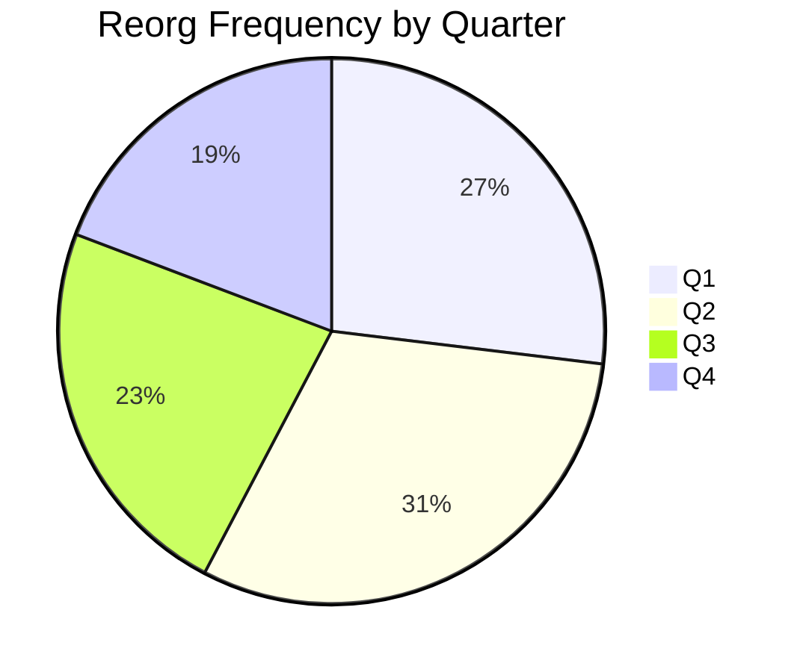
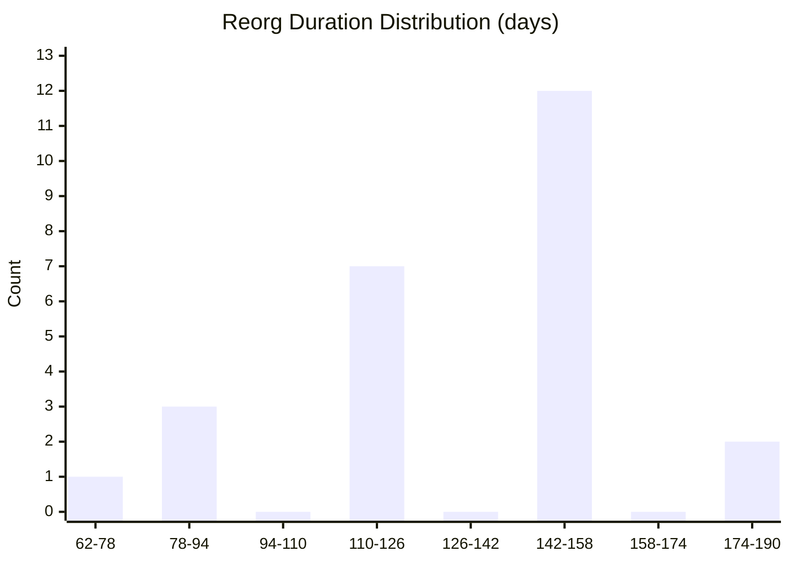
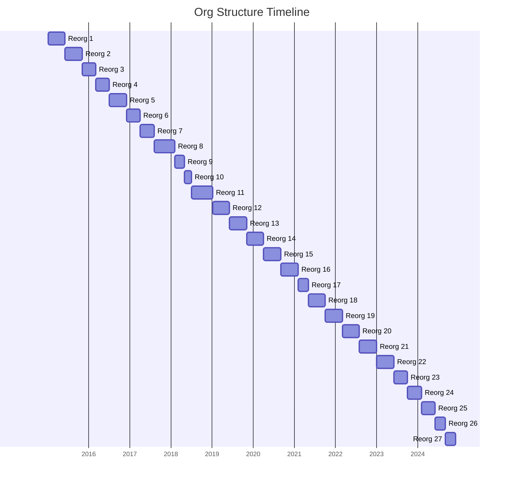
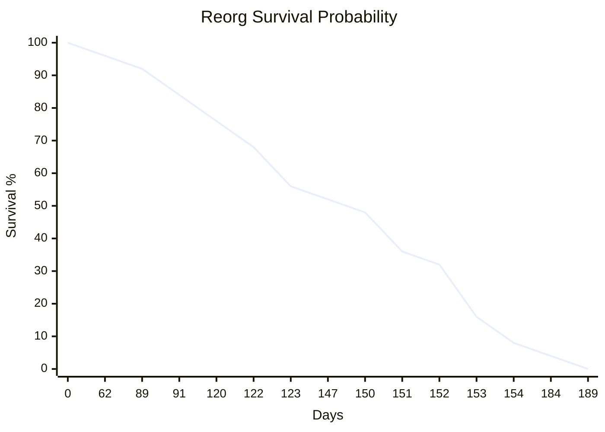
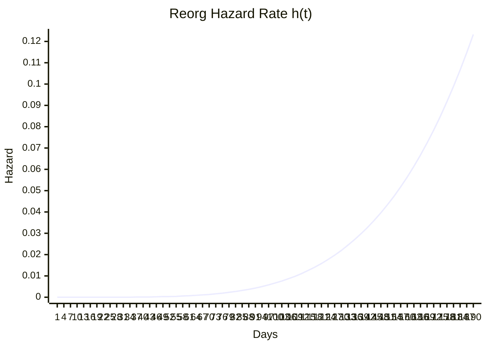
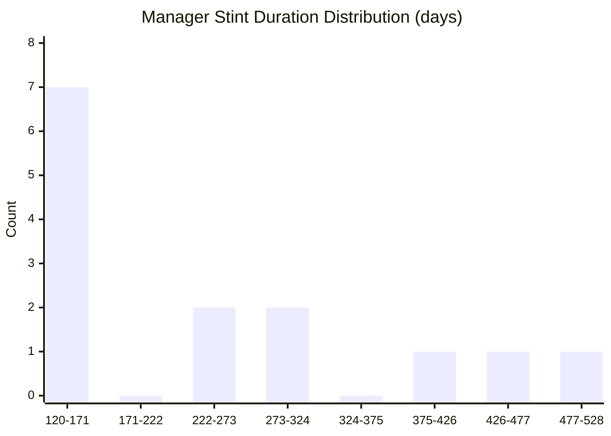
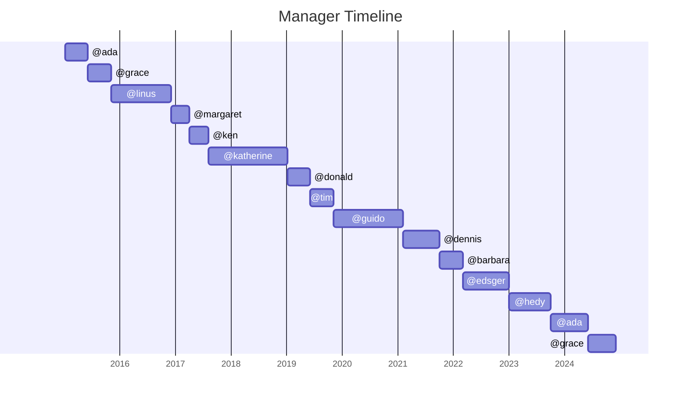
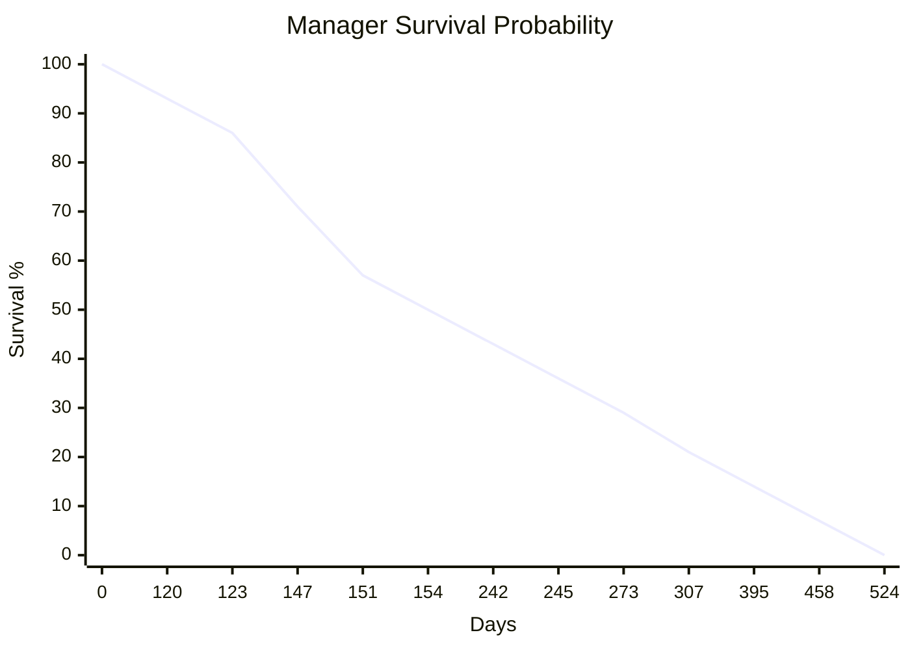
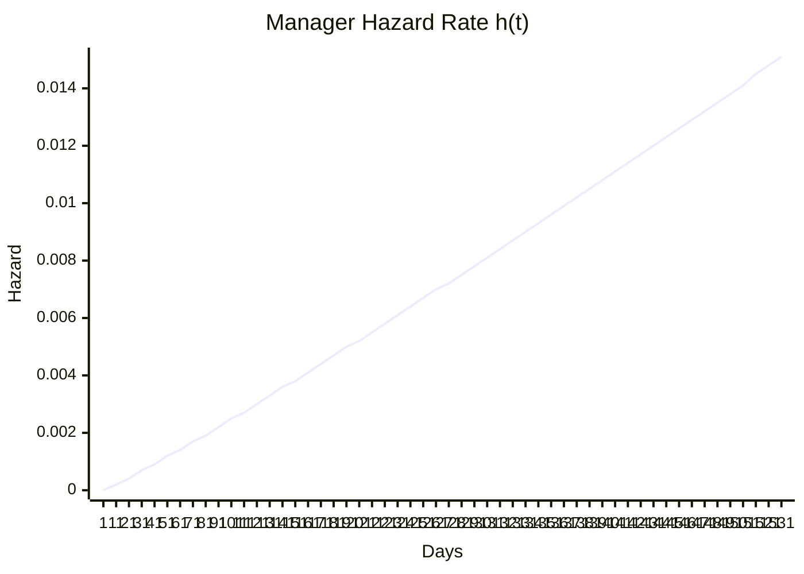

# Reorg Tuesday

*Ever feel like your org gets restructured every other Tuesday? This treats your
history of reorgs and manager changes as a [survival-analysis](https://en.wikipedia.org/wiki/Survival_analysis)
problem — Kaplan-Meier curves, Weibull MLE, Monte Carlo forecasts, a composite
risk score, and more — then renders it all as the charts below. Mostly for fun.
See [Reorgs happen](https://ben.balter.com/2026/06/07/reorgs-happen/) for the story
behind it.*

> **The data in [`managers.csv`](managers.csv) is synthetic sample data.** Swap in
> your own and regenerate: `npm install && npm start`. See [below](#about) for details.

Time at Acme: 9 years, 10 months, 3 weeks, and 6 days (2015-01-05 – 2024-12-02)

> *Final snapshot. Tenure ended 2024-12-02; analysis frozen as of that date and preserved for posterity.*

> **Reorg Risk: 🟠 51/100 (elevated)** | **Manager Risk: 🟠 47/100 (elevated)**

---

## Reorgs

```
 *   *  *  *   *  *  *  *    * * *   *   *   *   *  *   * *   *   *   *   *  *  *  *  *  *
|------------------------------------------------------------------------------------------|
 2015    2016    2017    2018    2019    2020    2021    2022     2023    2024  

```

### Descriptive statistics

| Metric | Value |
|--------|-------|
| Count | 25 |
| Min | 2 months, and 2 days |
| Max | 6 months, and 1 week |
| Mean | 4 months, and 2 weeks |
| Median | 4 months, 4 weeks, and 1 day |
| Q1 (25th percentile) | 4 months, and 1 day |
| Q3 (75th percentile) | 5 months, and 1 day |
| Std deviation | 4 weeks, and 2 days |
| Skewness | -0.61 (left-skewed) |
| Coefficient of variation | 22% (low variability) |
| Rate | 2.6/year (last 3 years: 2.7/year) |

### Current status

* Last reorg: 3 months ago ✅ — longer than 14% of historical tenures
* Longest ever gap: 6 months, and 1 week
* Per-cycle trend: Stable (R²=0.004)
* Calendar trend: Stable
* Weighted recent average: 4 months, 1 week, and 6 days

### Reorg probability

| Window | Probability |
|--------|------------|
| Next 30 days | 32% |
| Next 60 days | 69% |
| Next 90 days | 89% |
| Next 180 days | 100% |

### Frequency by quarter



### Most popular 

* Day: 1 (16)
* Month: Jun (4)
* Year: 2016 (3)
* Day of week: Monday (13)

### Duration histogram



### Reorg timeline



### Kaplan-Meier survival curve



### Hazard function



### Distribution fitting

| Model | Parameters | AIC | Selected |
|-------|-----------|-----|----------|
| Lognormal | μ=4.88, σ=0.25 | 249 |  |
| Weibull | k=5.55, λ=146.6 | 242.2 | ✅ |

### Bootstrap confidence intervals (10,000 resamples)

| Statistic | Estimate | 80% CI | 95% CI | SE |
|-----------|----------|--------|--------|-----|
| Mean | 4 months, and 2 weeks | 4 months, and 1 week – 4 months, 3 weeks, and 1 day | 4 months, and 2 days – 4 months, 3 weeks, and 5 days | 6 days |
| Median | 4 months, and 3 weeks | 4 months, and 2 days – 4 months, 4 weeks, and 2 days | 4 months, and 1 day – 5 months, and 1 day | 1 week, and 5 days |

### Monte Carlo simulation (10,000 iterations)

* **Median prediction**: 2025-01-17 (1 month, 2 weeks, and 1 day from now)
* **80% CI**: 2024-12-08 to 2025-02-19
* **95% CI**: 2024-11-16 to 2025-03-06
* Predicted duration: 4 months, and 2 weeks ± 4 weeks

### Forecast ensemble (7 models)

| Model | Prediction | Weight | Description |
|-------|-----------|--------|-------------|
| Historical Mean | 2025-01-15 | 9% | Average of 25 past durations |
| Historical Median | 2025-01-30 | 14% | Robust central tendency |
| Exponential Weighted | 2025-01-14 | 18% | Recency-weighted average with exponential decay |
| Linear Trend | 2025-01-11 | 9% | Linear regression extrapolation of duration trend |
| Lognormal MLE | 2025-01-12 | 9% | Lognormal(μ=4.88, σ=0.25) |
| Weibull MLE | 2025-01-17 | 18% | Weibull(k=5.55, λ=146.6) |
| Monte Carlo | 2025-01-17 | 23% | 10,000 simulations |

* **🎯 Ensemble prediction**: 2025-01-17 (1 month, 2 weeks, and 1 day from now)
* Model agreement: 94% (spread: 19 days)

### Next reorg predictions (classic)

* Min: 2024-11-03 (4 weeks, and 1 day ago)
* Max: 2025-03-10 (3 months, and 1 week from now)
* Mean: 2025-01-15 (1 month, 1 week, and 6 days from now)
* Median: 2025-01-30 (1 month, and 4 weeks from now)
* Q1: 2025-01-02 (1 month from now)
* Q3: 2025-02-02 (2 months, and 2 days from now)
* **80% Parametric CI**: 2025-01-03 to 2025-01-20

### Risk score decomposition

| Component | Score | Weight |
|-----------|-------|--------|
| Kaplan-Meier survival | 16/100 | 25% |
| Lognormal model | 89/100 | 20% |
| Weibull model | 96/100 | 20% |
| Trend analysis | 51/100 | 10% |
| Recency | 30/100 | 10% |
| Percentile rank | 16/100 | 15% |
| **Composite** | **🟠 51/100** | |

### Information theory

* Shannon entropy: 2.179 bits
* Normalized entropy: 0.656 (moderate disorder)
* Gini impurity: 0.733
* Effective number of states: 4.53

### Serial correlation

* Lag-1 autocorrelation: -0.088
* Lag-2 autocorrelation: -0.276
* Lag-3 autocorrelation: 0.237
* Ljung-Box test: Q=4.163, p=0.2444 → Durations are independent ✅

### Poisson process test

* Observed rate: 0.0069 events/day
* Dispersion index: 6.56 (overdispersed — clustered events)
* χ² statistic: 0.4, p=0.9825
* Verdict: Not a homogeneous Poisson process ⚠️


---

## Managers

```
 *   *  *         *  *  *            *   *   *          *     *   *       *     *     *   
|------------------------------------------------------------------------------------------|
 2015    2016    2017    2018    2019    2020    2021    2022     2023    2024  

```

### Descriptive statistics

| Metric | Value |
|--------|-------|
| Count | 14 |
| Min | 3 months, 4 weeks, and 1 day |
| Max | 1 year, 5 months, and 1 week |
| Mean | 8 months, and 2 days |
| Median | 6 months, 2 weeks, and 2 days |
| Q1 (25th percentile) | 4 months, 3 weeks, and 6 days |
| Q3 (75th percentile) | 9 months, 3 weeks, and 4 days |
| Std deviation | 4 months, 1 week, and 4 days |
| Skewness | 1.04 (right-skewed) |
| Coefficient of variation | 54% (high variability) |
| Churn rate | 1.3/year (last 3 years: 1.3/year) |

### Current status

* Last manager change: 6 months ago ✅ — longer than 50% of historical tenures
* Longest ever gap: 1 year, 5 months, and 1 week
* Per-cycle trend: Getting less frequent (5.3 more days per cycle) (R²=0.028)
* Calendar trend: Stable
* Weighted recent average: 8 months, 1 week, and 1 day

### Manager change probability

| Window | Probability |
|--------|------------|
| Next 30 days | 19% |
| Next 60 days | 35% |
| Next 90 days | 49% |
| Next 180 days | 76% |

### Managers by tenure


| Manager | Tenure |
|---------|--------|
| @katherine | 1 year, 5 months, and 1 week |
| @guido | 1 year, 3 months, and 2 days |
| @linus | 1 year, 4 weeks, and 1 day |
| @ada | 1 year, 3 weeks, and 5 days |
| @grace | 11 months, and 1 day |
| @edsger | 10 months, and 2 days |
| @hedy | 8 months, 4 weeks, and 1 day |
| @dennis | 7 months, 4 weeks, and 1 day |
| @tim | 4 months, 4 weeks, and 2 days |
| @barbara | 4 months, 4 weeks, and 2 days |
| @donald | 4 months, 3 weeks, and 5 days |
| @margaret | 4 months, and 2 days |
| @ken | 3 months, 4 weeks, and 1 day |

### Duration histogram



### Manager timeline



### Kaplan-Meier survival curve



### Hazard function



### Distribution fitting

| Model | Parameters | AIC | Selected |
|-------|-----------|-----|----------|
| Lognormal | μ=5.38, σ=0.5 | 174 | ✅ |
| Weibull | k=2.09, λ=279.2 | 176.7 |  |

### Bootstrap confidence intervals (10,000 resamples)

| Statistic | Estimate | 80% CI | 95% CI | SE |
|-----------|----------|--------|--------|-----|
| Mean | 8 months, and 1 day | 6 months, 2 weeks, and 6 days – 9 months, 2 weeks, and 2 days | 6 months, and 2 days – 10 months, 1 week, and 4 days | 1 month, and 3 days |
| Median | 6 months, and 3 weeks | 4 months, 4 weeks, and 2 days – 8 months, 4 weeks, and 1 day | 4 months, 3 weeks, and 5 days – 10 months, and 2 days | 1 month, 2 weeks, and 6 days |

### Monte Carlo simulation (10,000 iterations)

* **Median prediction**: 2025-01-08 (1 month, and 6 days from now)
* **80% CI**: 2024-09-26 to 2025-07-24
* **95% CI**: 2024-08-23 to 2025-12-29

### Forecast ensemble (7 models)

| Model | Prediction | Weight | Description |
|-------|-----------|--------|-------------|
| Historical Mean | 2025-02-04 | 9% | Average of 14 past durations |
| Historical Median | 2024-12-18 | 14% | Robust central tendency |
| Exponential Weighted | 2025-02-10 | 18% | Recency-weighted average with exponential decay |
| Linear Trend | 2025-03-15 | 9% | Linear regression extrapolation of duration trend |
| Lognormal MLE | 2025-01-06 | 18% | Lognormal(μ=5.38, σ=0.50) |
| Weibull MLE | 2025-01-23 | 9% | Weibull(k=2.09, λ=279.2) |
| Monte Carlo | 2025-01-08 | 23% | 10,000 simulations |

* **🎯 Ensemble prediction**: 2025-01-20 (1 month, 2 weeks, and 4 days from now)
* Model agreement: 72% (spread: 87 days)

### Most popular 

* Day: 1 (7)
* Month: Jan (3)
* Year: 2015 (3)
* Day of week: Monday (10)

### Risk score decomposition

| Component | Score | Weight |
|-----------|-------|--------|
| Kaplan-Meier survival | 50/100 | 25% |
| Lognormal model | 49/100 | 20% |
| Weibull model | 42/100 | 20% |
| Trend analysis | 39/100 | 10% |
| Recency | 46/100 | 10% |
| Percentile rank | 50/100 | 15% |
| **Composite** | **🟠 47/100** | |

### Information theory

* Shannon entropy: 2.064 bits
* Normalized entropy: 0.621
* Gini impurity: 0.684
* Effective states: 4.18

### Serial correlation

* Lag-1 autocorrelation: -0.377 ⚠️ significant
* Ljung-Box: Q=18.794, p=0.0003 → Dependent ⚠️

### Poisson process test

* Dispersion index: 70.82
* χ² test: p=0.9311 → Not Poisson ⚠️


---

## About

Everything above is generated from [`managers.csv`](managers.csv), a tiny CSV where
each row is a reorg (a change to your reporting line or org structure). The bundled
data is **synthetic sample data** — invented names, dates, and events — so the whole
thing runs and renders out of the box.

### Run it on your own data

```bash
npm install
# edit managers.csv with your own reorg history
npm start        # regenerates this README.md
```

Each row of `managers.csv` has: `date` (YYYY-MM-DD of the reorg), `manager`
(your manager's handle), `stepmanager` (their manager), `duration` (a human-readable
label — cosmetic), `rung` (how many levels to the top), and `notes` (freeform).
Consecutive rows with the same `manager` are collapsed into a single stint. By
default the analysis is frozen to a fixed end date (`END_DATE` in
[`src/context.ts`](src/context.ts)); set it to `null` to compute against today.

### Development

```bash
npm test              # run the test suite
npm run lint          # eslint
npm run format:check  # prettier
```

---

*Generated with 10,000 Monte Carlo simulations, bootstrap resampling, Weibull MLE, Kaplan-Meier survival analysis, CUSUM changepoint detection, Shannon entropy, Ljung-Box serial correlation testing, Poisson process goodness-of-fit, and a 6-model forecast ensemble. Because why not.*
